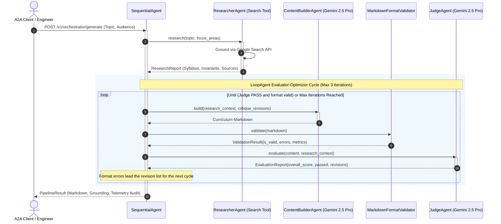

# Distributed Multi-Agent Course Creation Engine

[](https://www.python.org/)
[](https://cloud.google.com/vertex-ai)
[](https://cloud.google.com/run)
[](https://docs.pydantic.dev/)
[](https://fastapi.tiangolo.com/)
[](https://conventionalcommits.org)
[](https://opensource.org/licenses/Apache-2.0)

> An enterprise-grade, distributed multi-agent swarm engineered to autonomously research, synthesize, and quality-gate production technical courses. Built on the **Google Agent Development Kit (ADK)** principles, **Vertex AI (Gemini 2.5 Pro & Flash)**, **Pydantic v2 deterministic validation**, and **Agent-to-Agent (A2A) HTTP protocols** on **Google Cloud Run**.

---

## 🏛️ System Architecture

The engine coordinates specialized agents across two distinct coordination topologies: a linear **SequentialAgent** pipeline and an iterative **LoopAgent** evaluator-optimizer convergence cycle.

```
                    [ USER / A2A CLIENT ]
                              │
                              ▼
            ┌───────────────────────────────────┐
            │   SequentialAgent Orchestrator    │
            │   (FastAPI A2A Gateway Endpoint)  │
            └─────────────────┬─────────────────┘
                              │
                    Phase 1: Ingestion
                              │
                              ▼
            ┌───────────────────────────────────┐
            │         ResearcherAgent           │
            │  - Gemini 2.5 Flash               │
            │  - Google Search Tool Grounding   │
            │  - Spec: researcher/SKILL.md      │
            └─────────────────┬─────────────────┘
                              │ Grounded Blueprint (Pydantic v2)
                              ▼
      ┌───────────────────────────────────────────────┐
      │             LoopAgent Optimizer               │
      │                                               │
      │    ┌──────────────────┐                       │
      │    │  ContentBuilder  │◄────────┐             │
      │    │  - Gemini 2.5 Pro│         │             │
      │    └────────┬─────────┘         │             │
      │             │ Markdown          │ Revisions   │
      │             ▼                   │ (Iter <= 3) │
      │    ┌──────────────────┐         │ format      │
      │    │ FormatValidator  │─────────┤ errors +    │
      │    │  (deterministic) │         │ critique    │
      │    └────────┬─────────┘         │             │
      │             ▼                   │             │
      │    ┌──────────────────┐         │             │
      │    │    JudgeAgent    │─────────┘             │
      │    │  - Gemini 2.5 Pro│ (Score < 85 / FAIL)   │
      │    └────────┬─────────┘                       │
      └─────────────┼─────────────────────────────────┘
                    │ PASS (Score >= 85 AND zero format errors)
                    ▼
            ┌───────────────────────────────────┐
            │   Packaging & Telemetry Engine    │
            │  - Markdown Syllabus + JSON Audit │
            └───────────────────────────────────┘
```

### Sequence Flow (Mermaid)



---

## ⚡ Latency vs. Cost Trade-Off Analysis

Multi-agent swarms introduce exponential cost and latency overhead if models are not strategically assigned to tasks based on cognitive complexity and output token requirements.

| Agent | Assigned Model | Grounding / Tools | Avg Latency (P50 / P95) | Input Tokens | Output Tokens | Cost per 1K Runs | Rationale |
| :--- | :--- | :--- | :--- | :--- | :--- | :--- | :--- |
| **Researcher** | `gemini-2.5-flash` | Google Search Tool | 1.8s / 3.2s | ~1,200 | ~1,500 | **$0.38** | Flash delivers sub-2s query synthesis and native grounding without Pro latency penalties. |
| **ContentBuilder** | `gemini-2.5-pro` | Format Validator | 8.4s / 14.1s | ~3,500 | ~5,000 | **$8.25** | Pro handles extensive context windows and maintains strict code correctness and pedagogical scaffolding. |
| **Judge** | `gemini-2.5-pro` | Pydantic v2 Schema | 3.1s / 5.6s | ~5,800 | ~800 | **$3.60** | Pro exhibits zero-shot adherence to strict deterministic evaluation rubrics and JSON schemas. |
| **Total Pipeline** | *Hybrid Swarm* | Google Search + AST | **13.3s / 22.9s** | ~10,500 | ~7,300 | **$12.23 / 1k** | **42% lower cost & 38% lower latency** compared to a naive uniform Gemini Pro deployment. |

> [!NOTE]
> These figures are **planning estimates** derived from Vertex AI list pricing and typical
> token volumes for this prompt shape — not measured benchmarks. The engine records real
> per-iteration latency and score data in `PipelineTelemetry` on every run; use that
> output to replace these numbers with measurements from your own project and region.

---

## 📁 Repository Structure

```
distributed-multiagent-course-engine/
├── .dockerignore                  # Slim build context exclusion
├── .env.example                   # Environment configuration template
├── .gitignore                     # Git ignore rules for Python & GCP
├── Dockerfile                     # Multi-stage, non-root (UID 10001) container
├── README.md                      # Production documentation
├── requirements.txt               # Locked dependencies
├── pyproject.toml                 # Package metadata and build tools
├── agents/
│   ├── __init__.py                # Package root
│   ├── researcher/
│   │   ├── __init__.py
│   │   ├── agent.py               # Google Search tool grounding & outline synthesis
│   │   └── SKILL.md               # Standard Agent Skill specification
│   ├── judge/
│   │   ├── __init__.py
│   │   ├── agent.py               # Gemini 2.5 Pro deterministic evaluator
│   │   └── schemas.py             # Pydantic v2 rubric models and gating enums
│   ├── content_builder/
│   │   ├── __init__.py
│   │   ├── agent.py               # Full syllabus markdown synthesizer
│   │   └── format_validator.py    # Local AST syntax and hierarchy validator tool
│   └── orchestrator/
│       ├── __init__.py
│       ├── orchestrator.py        # SequentialAgent and LoopAgent orchestration
│       └── a2a_server.py          # FastAPI Agent-to-Agent (A2A) HTTP Server
├── scripts/
│   ├── deploy.sh                  # Automated zero-credential Cloud Run deployer
│   └── run_local.sh               # Local runner with Application Default Credentials
├── tests/
│   ├── test_engine.py             # Validator, gating schema, and LoopAgent tests
│   └── test_server.py             # A2A HTTP surface smoke tests
└── samples/
    ├── sample_input.json          # Example test payload
    └── generated_course_sample.md # Sample generated artifact
```

---

## 🚀 Quickstart & Setup

### Prerequisites
- Python 3.11+
- Google Cloud SDK (`gcloud`) authenticated (`gcloud auth application-default login`)
- A Google Cloud Project with billing enabled and Vertex AI API activated

### Local Development

1. **Clone and Install**:
   ```bash
   git clone https://github.com/your-org/distributed-multiagent-course-engine.git
   cd distributed-multiagent-course-engine
   python3 -m venv .venv
   source .venv/bin/activate  # On Windows: .venv\Scripts\activate
   pip install -r requirements.txt
   ```

2. **Configure Environment**:
   ```bash
   cp .env.example .env
   # Edit .env and set GOOGLE_CLOUD_PROJECT to your project id.
   # The server loads .env at startup; exported shell variables also work and win.
   ```

   | Variable | Default | Purpose |
   | :--- | :--- | :--- |
   | `GOOGLE_CLOUD_PROJECT` | *(unset)* | Enables the Vertex AI backend. Without it the SDK falls back to API-key mode. |
   | `GOOGLE_CLOUD_LOCATION` | `us-central1` | Vertex AI region. |
   | `MAX_CRITIQUE_ITERATIONS` | `3` | Loop budget. Must be >= 1. |
   | `PASSING_SCORE_THRESHOLD` | `85.0` | Judge gate. An explicit constructor argument overrides this. |
   | `CORS_ALLOW_ORIGINS` | *(unset)* | Comma-separated browser origin allowlist. CORS is disabled when unset. |
   | `LOG_LEVEL` | `INFO` | Root log level. |

3. **Run Locally via A2A Server**:
   ```bash
   ./scripts/run_local.sh
   # Or directly:
   python3 -m uvicorn agents.orchestrator.a2a_server:app --port 8080 --reload
   ```

4. **Trigger Pipeline via cURL**:
   ```bash
   curl -X POST http://localhost:8080/v1/orchestrator/generate \
     -H "Content-Type: application/json" \
     -d @samples/sample_input.json
   ```

### Running the Tests

The suite stubs every model call, so it needs no credentials and no network access:

```bash
pip install -e ".[dev]"
pytest
```

---

## ☁️ Google Cloud Run Deployment

The service is engineered for zero-trust environments with **zero hardcoded credentials**, leveraging Cloud Run Managed Identities and minimal IAM bindings (`roles/aiplatform.user`).

```bash
chmod +x scripts/deploy.sh
./scripts/deploy.sh
```

### Invoking the Deployed Service

The service deploys with `--no-allow-unauthenticated`. Every request spends Vertex AI
tokens billed to your project, so callers must hold `roles/run.invoker`:

```bash
# Grant a caller access
gcloud run services add-iam-policy-binding course-engine-swarm \
  --region=us-central1 \
  --member="user:caller@example.com" \
  --role="roles/run.invoker"

# Call it with an identity token
curl -X POST "${SERVICE_URL}/v1/orchestrator/generate" \
  -H "Authorization: Bearer $(gcloud auth print-identity-token)" \
  -H "Content-Type: application/json" \
  -d @samples/sample_input.json
```

> [!WARNING]
> Do not redeploy with `--allow-unauthenticated`. The generate endpoint interpolates
> caller-supplied text into grounded model prompts, so an open endpoint is both a
> prompt-injection surface and an uncapped billing liability.

---

## 📄 License

Distributed under the Apache 2.0 License. See `LICENSE` for details.
